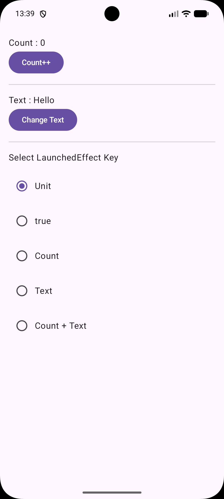
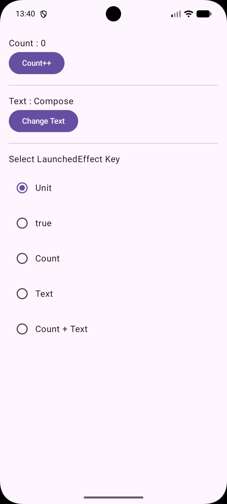

# LaunchedEffect Key Sample

Jetpack Compose の `LaunchedEffect` のキーによる再実行タイミングを確認するサンプルアプリです。

## 概要

- `Unit`
- `true`
- `Count`
- `Text`
- `Count + Text`

の5種類のキーを切り替えて挙動を確認できます。

各 `LaunchedEffect` はログを出力し、

- START
- END

から Coroutine の開始・キャンセルを確認できます。

## スクリーンショット

### 初期状態

### Count変更後

### テキスト変更後

## 関連記事

[Jetpack ComposeのLaunchedEffectはキーによっていつ再実行される？ログで挙動を検証してみた](https://qiita.com/nao-android/items/5fa6f532bb0f626cf273)

## ライセンス
MIT License
